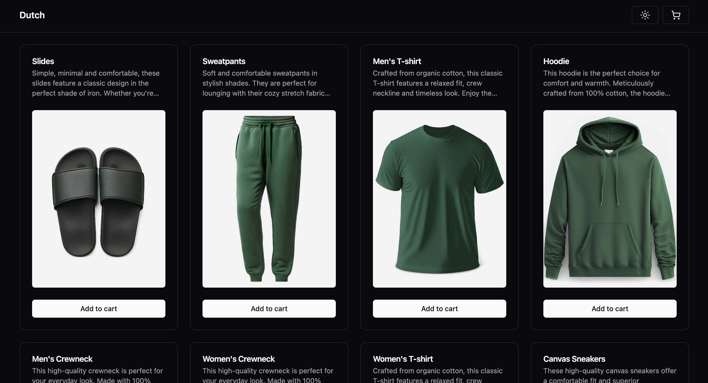

<h2 align="center">
  <p>Assessment task for Dutch.com</p>
  <a href="https://d1ulno2xdygae6.cloudfront.net/" target="_blank">LIVE DEMO</a>
</h2>

<div align="center">
  
</div>

## Features

- ⚡️  Powered by [Vue 3](https://github.com/vuejs/core), [Vite](https://github.com/vitejs/vite), [pnpm](https://pnpm.io/)

- ↔️ [Apollo GraphQL](https://apollo.vuejs.org/)

- ⚙️ Types generation with [GraphQL-Codegen](https://the-guild.dev/graphql/codegen/docs/getting-started)

- 🚫 No State Management libraries. [Composables Only](https://vuejs.org/guide/reusability/composables)

- 🦾 [TypeScript](https://www.typescriptlang.org/)

- 🗂 [File based routing](https://github.com/posva/unplugin-vue-router)

- 📦 [Components auto importing](https://github.com/unplugin/unplugin-vue-components)

- 🎨 [Tailwind](https://tailwindcss.com/)

- 🖼️ Beautiful [Shadcn Components](https://www.shadcn-vue.com/)

- 😃 [Radix Icons](https://www.radix-ui.com/icons)

- 🔥 [`<script setup>` Syntax](https://vuejs.org/api/sfc-script-setup)

- 🌐 Deployed on [AWS S3](https://aws.amazon.com/s3/). Delivered by [AWS CloudFront](https://aws.amazon.com/cloudfront/).

- ☀️ Light/Dark theme switch.

<br>

## Try it now!

```bash
git clone git@github.com:AndrewKuktenko/dutch.app.git

cd dutch.app

pnpm i # If pnpm is not installed, please follow these instructions:  https://pnpm.io/installation

pnpm run dev
```